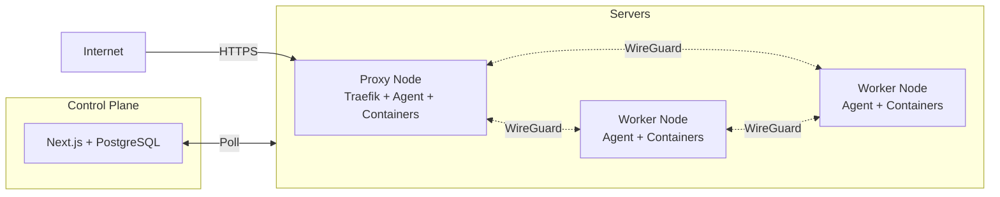

# Techulus Cloud

A container deployment platform with private-first networking.

> ⚠️ **Experimental**: This is a very experimental project and is nowhere near production ready. Use at your own risk.

## Features

- **Container Orchestration**: Deploy containers via Podman with static IPs and automatic rollouts
- **WireGuard Mesh**: Full mesh private networking between all servers
- **Two Node Types**: Proxy nodes handle public traffic, worker nodes run containers
- **Automatic HTTPS**: Centralized ACME certificate management with Let's Encrypt
- **Service Discovery**: Built-in DNS server for `.internal` domain resolution
- **Geographic Distribution**: Multi-proxy support capable of proximity-aware load balancing

## Tech Stack

| Component | Technology |
|-----------|------------|
| Control Plane | Next.js (full-stack) |
| Database | PostgreSQL + Drizzle |
| Server Agent | Go |
| Container Runtime | Podman |
| Reverse Proxy | Traefik |
| Private Network | WireGuard |

## How It Works

**Traffic Flow:**
- **Public**: Internet → Proxy Node → Traefik (TLS) → WireGuard → Container
- **Internal**: Container → DNS (.internal) → WireGuard → Container

## Architecture

See [docs/ARCHITECTURE.md](docs/ARCHITECTURE.md) for detailed documentation.

## TODO

- Managed Databases: Deploy standalone databases (PostgreSQL, MySQL, Redis, etc.) with automated configuration
- Notifications: Alert channels for deployment events and system alerts
- Templates: Pre-configured templates for popular applications
