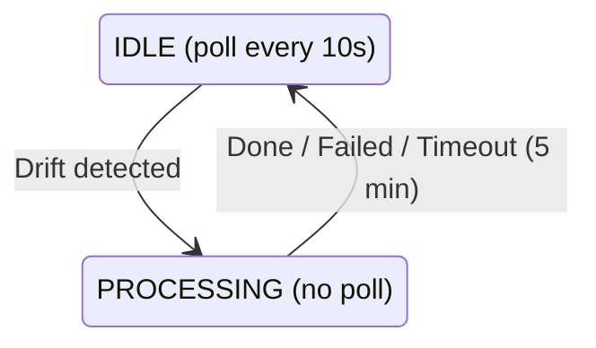

## State Machine

The agent uses a two-state reconciliation model:

### IDLE State

- Polls the control plane every 10 seconds for expected state.
- Compares expected state against actual state.
- Transitions to `PROCESSING` when drift is detected.

### PROCESSING State

- Uses a snapshot of expected state without re-polling.
- Applies one change at a time:
  1. Stop orphan containers with no deployment ID.
  2. Start containers in `created` or `exited` state.
  3. Deploy missing containers.
  4. Redeploy containers with the wrong image.
  5. Update DNS records.
  6. Update Traefik routes on proxy nodes.
  7. Update WireGuard peers.
- Times out after 5 minutes.
- Always reports status before returning to `IDLE`.

## Drift Detection

Drift detection is deterministic and uses hashes:

- **Containers**: missing, orphaned, wrong state, or image mismatch.
- **DNS**: hash of sorted records.
- **Traefik**: hash of sorted routes on proxy nodes.
- **WireGuard**: hash of sorted peers.

## Build System

Agents can build container images directly from GitHub sources:

1. Poll for pending builds.
2. Claim the build to prevent duplicate work.
3. Clone the repository using a GitHub App installation token.
4. Run Railpack to generate a build plan, or use the existing Dockerfile.
5. Build the image with BuildKit.
6. Push the image to the registry.
7. Update build status.

Build logs stream to VictoriaLogs in real time.

## Leased Commands

Agents report status to the control plane on a short interval. The status response
can include one command for operations that cannot be modeled purely as expected
state. The command's attempt number acts as a generation guard: the agent reports
the result with that attempt, and stale completions from older attempts are
ignored. If an agent crashes or stops renewing the command through status
reports, the command can be retried up to the fixed attempt limit.

| Type | Description |
| --- | --- |
| `restart` | Restart a specific container |
| `stop` | Stop a specific container |
| `force_cleanup` | Force remove containers for a service |
| `cleanup_volumes` | Remove volume directories for a service |
| `deploy` | Handled through expected-state reconciliation |

## Serverless Gateway

Proxy agents run a local HTTP wake gateway on `127.0.0.1:18080`. The control
plane emits Traefik routes to this gateway only when the service has a
proxy-hosted serverless deployment. Worker-only serverless services keep normal
direct routes because worker deployments do not sleep.

For serverless service traffic, Traefik forwards the public request to the local
gateway. The gateway resolves the host from expected-state serverless metadata,
queues `wake_started` as a status transition, starts local proxy-hosted
containers from expected-state config, waits for ready upstreams, then proxies
the original request to the selected container over the WireGuard mesh.

The gateway keeps a short upstream cache and collapses concurrent wake requests
for the same host. Request cancellation is respected while waiting for a shared
wake result.

The gateway tracks request activity in memory. When a host stays idle for the
service's configured sleep timeout, the proxy agent removes only its local
proxy-hosted containers and queues a `sleep` status transition. The control plane
records the transition and updates dashboard/routing state; it does not run the
idle timer.

If a status report fails, pending serverless transitions stay queued in memory
and are retried. A locally slept deployment is also guarded from immediate
reconcile until a fresh expected-state fetch confirms the control plane recorded
the sleep or rejects it by continuing to advertise `desiredState: "running"`.
