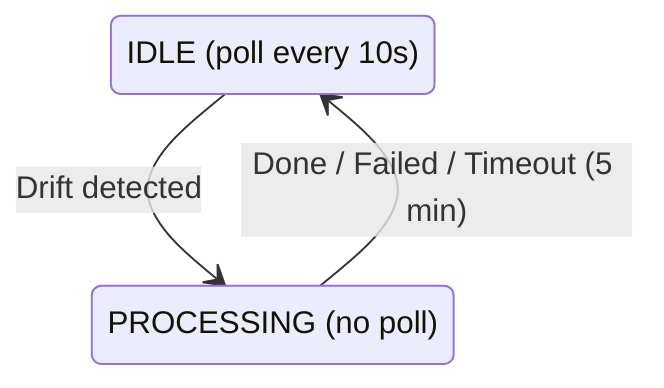

## State Machine

The agent uses a two-state reconciliation model:

### IDLE State

- Polls the control plane every 10 seconds for expected state.
- Compares expected state against actual state.
- Transitions to `PROCESSING` when drift is detected.

### PROCESSING State

- Uses a snapshot of expected state without re-polling.
- Applies one change at a time:
  1. Stop orphan containers with no deployment ID.
  2. Start containers in `created` or `exited` state.
  3. Deploy missing containers.
  4. Redeploy containers with the wrong image.
  5. Update DNS records.
  6. Update Traefik routes on proxy nodes.
  7. Update WireGuard peers.
- Times out after 5 minutes.
- Always reports status before returning to `IDLE`.

## Drift Detection

Drift detection is deterministic and uses hashes:

- **Containers**: missing, orphaned, wrong state, or image mismatch.
- **DNS**: hash of sorted records.
- **Traefik**: hash of sorted routes on proxy nodes.
- **WireGuard**: hash of sorted peers.

## Build System

Agents can build container images directly from GitHub sources:

1. Poll for pending builds.
2. Claim the build to prevent duplicate work.
3. Clone the repository using a GitHub App installation token.
4. Run Railpack to generate a build plan, or use the existing Dockerfile.
5. Build the image with BuildKit.
6. Push the image to the registry.
7. Update build status.

Build logs stream to VictoriaLogs in real time.

## Work Queue

Agents also process queue items for operations that cannot be modeled purely as expected state:

| Type | Description |
| --- | --- |
| `restart` | Restart a specific container |
| `stop` | Stop a specific container |
| `force_cleanup` | Force remove containers for a service |
| `cleanup_volumes` | Remove volume directories for a service |
| `deploy` | Handled through expected-state reconciliation |
