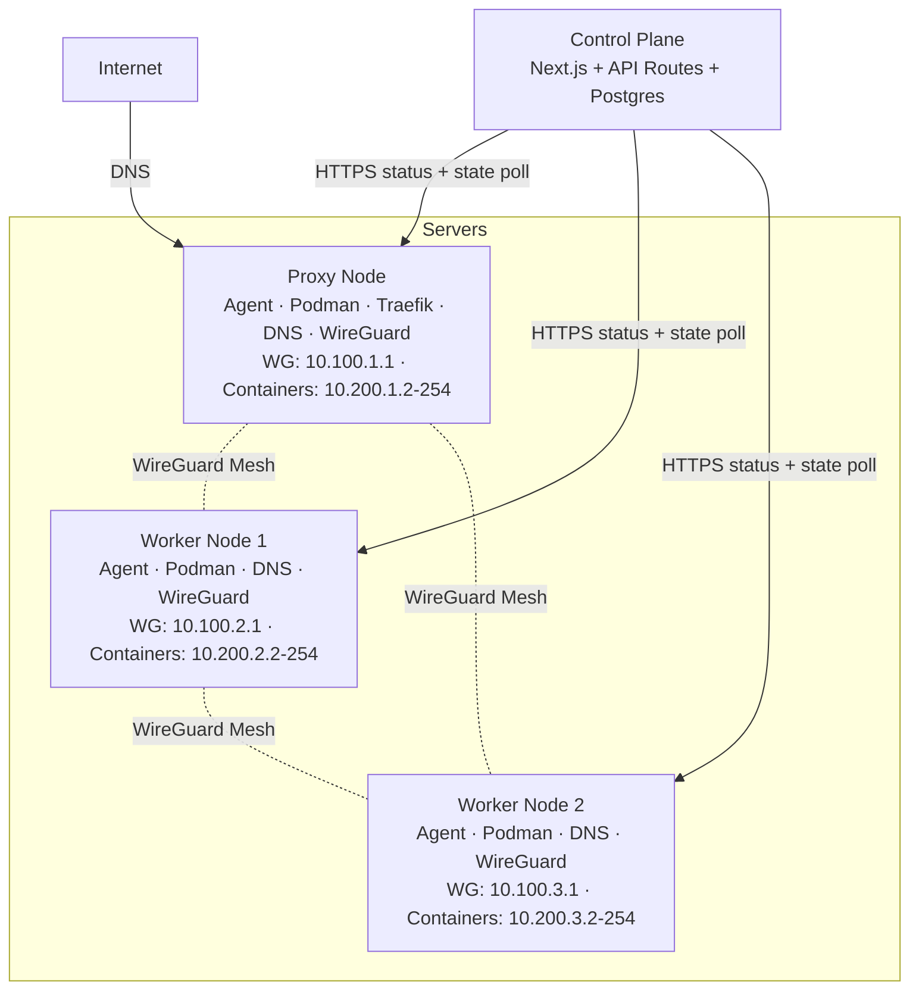
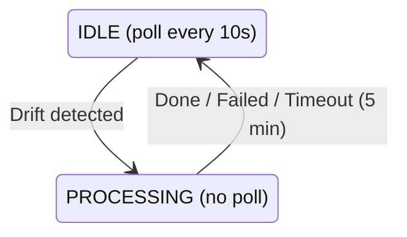
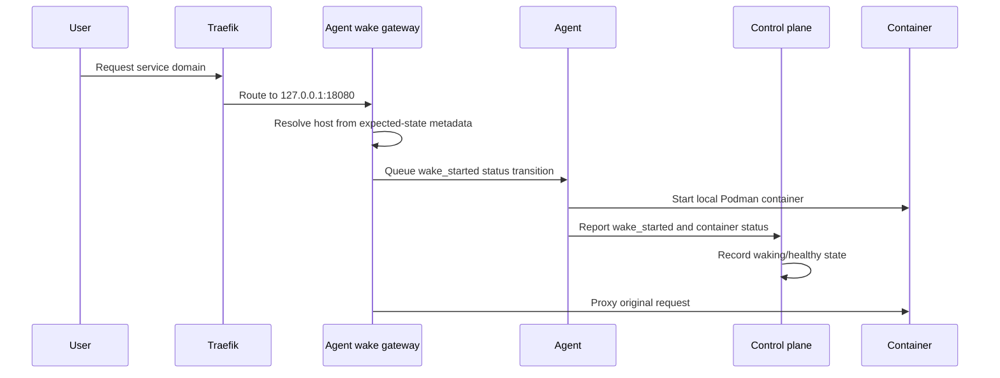

# Techulus Cloud Architecture

## Overview

Techulus Cloud is a stateless container deployment platform built around three core principles:

1. **Workloads are disposable**: containers can be killed and recreated at any time.
2. **Two node types**: proxy nodes handle public traffic, worker nodes run containers.
3. **Networking is private-first**: services communicate over a WireGuard mesh, with public exposure routed through proxy nodes.

## Tech Stack

| Component | Choice | Rationale |
| --- | --- | --- |
| Control Plane | Next.js (full-stack) | Single deployment with React frontend and API routes |
| Database | Postgres + Drizzle | Simple, low operational overhead, easy backup |
| Background Jobs | Inngest (self-hosted) | Durable workflows, retries, event-driven orchestration |
| Server Agent | Go | Single binary that shells out to Podman |
| Container Runtime | Podman | Docker-compatible, daemonless, bridge networking with static IPs |
| Reverse Proxy | Traefik | Automatic HTTPS via Let's Encrypt, runs on proxy nodes only |
| Private Network | WireGuard | Full mesh coordinated by the control plane |
| Service Discovery | Built-in DNS | Agent serves `.internal` domains |
| Agent Communication | Pull-based HTTP | Agent polls expected state and receives leased commands through status reports |

## Node Types

| Type | Traefik | Public Traffic | Containers |
| --- | --- | --- | --- |
| Proxy | Yes | Handles TLS termination | Yes |
| Worker | No | None | Yes |

- **Proxy nodes** handle incoming public traffic, terminate TLS using HTTP-01 ACME, and route requests to containers over WireGuard.
- **Worker nodes** run containers only and have no public exposure.

## Architecture Diagram



## Agent State Machine

The agent uses a two-state machine to prevent race conditions during reconciliation.



### IDLE State

- Poll the control plane every 10 seconds for expected state.
- Compare expected state versus actual state for containers, DNS, Traefik, and WireGuard.
- If no drift exists, send a status report and remain in `IDLE`.
- If drift is detected, snapshot expected state and transition to `PROCESSING`.

Traefik drift detection only applies on proxy nodes.

### PROCESSING State

- Stop polling and work from the expected-state snapshot.
- Apply one change at a time with verification.
- Re-check drift after every change.
- Transition back to `IDLE` once drift is resolved.
- Force a return to `IDLE` after 5 minutes if reconciliation stalls.
- Always send a status report before returning to `IDLE`.

### Drift Detection

The agent uses hash comparisons for deterministic drift detection:

- **Containers**: missing, orphaned, wrong state, or image mismatch.
- **DNS**: hash of sorted records versus current DNS config.
- **Traefik**: hash of sorted routes and certificates versus current config on proxy nodes, plus confirmation that Traefik successfully reloaded the newest dynamic files.
- **WireGuard**: hash of sorted peers versus current `wg0.conf`.

### Container Reconciliation Order

1. Stop orphan containers with no deployment ID.
2. Start containers in `created` or `exited` state.
3. Deploy missing containers.
4. Redeploy containers with wrong state or image mismatch.
5. Update DNS records.
6. Update Traefik certificates and routes on proxy nodes, then confirm a successful reload.
7. Update WireGuard peers.

## Rollout Stages

```text
queued -> preparing -> certificates -> deploying -> health_check -> dns_sync -> completed
```

| Stage | Description |
| --- | --- |
| `queued` | Rollout is waiting for the previous rollout of the service to finish |
| `preparing` | Placements and target servers are being validated |
| `certificates` | Certificates for public domains are being provisioned |
| `deploying` | Agents are creating and starting candidate containers |
| `health_check` | Configured health checks are being evaluated; without one, a running container satisfies this stage |
| `dns_sync` | Displayed as **Routing traffic**. Every frozen workload target must have matching DNS; every frozen proxy target must also have matching routes and certificates loaded by Traefik |
| `completed` | Routing convergence is confirmed and old deployments can be stopped |

Special states:

- `unknown`: the agent stopped reporting this deployment and the container may still exist.
- `stopped`: the container was explicitly stopped.
- `failed`: the deployment failed, such as during health checks.
- `rolled_back`: rollout failed and reverted to the previous deployment.

For each rollout, the control plane freezes the required target set immediately before promotion. Private services wait for their workload servers. Public services also wait for every proxy that was online at promotion. Agents acknowledge the exact rollout ID only after their expected snapshot converges; unrelated or stale acknowledgements cannot complete another rollout.

With no configured health check, `healthy` means only that the container is running. Routing convergence prevents completion before network configuration is live, but application-level readiness remains the responsibility of a user-configured health check.

## Networking

### IP Address Scheme

| Range | Purpose |
| --- | --- |
| `10.100.X.1` | WireGuard IP for server `X` |
| `10.200.X.2-254` | Container IPs on server `X` |

`X` is the server subnet ID from `1` to `255`.

### WireGuard Mesh

Each server gets a `/24` subnet for routing:

- Server 1: `10.100.1.0/24` with WireGuard IP `10.100.1.1`
- Server 2: `10.100.2.0/24` with WireGuard IP `10.100.2.1`

Every server peers with every other server. `AllowedIPs` includes both WireGuard and container subnets:

```ini
AllowedIPs = 10.100.2.0/24, 10.200.2.0/24
```

### Container Network

Each server has a Podman bridge network:

```bash
podman network create \
  --driver bridge \
  --subnet 10.200.1.0/24 \
  --gateway 10.200.1.1 \
  --disable-dns \
  techulus
```

Containers receive static IPs assigned by the control plane:

```bash
podman run -d \
  --name service-deployment \
  --network techulus \
  --ip 10.200.1.2 \
  --label techulus.deployment.id=<deployment-id> \
  --label techulus.service.id=<service-id> \
  traefik/whoami
```

### DNS Resolution

Each agent runs a built-in DNS server for `.internal` domains:

- It listens on the container gateway IP, such as `10.200.1.1`.
- It configures `systemd-resolved` to forward `.internal` queries.
- Records are pushed from the control plane through expected state.

Services resolve through `.internal` names with round-robin across replicas.

### Traefik on Proxy Nodes

Proxy nodes receive routes and certificates from the control plane:

- Routes live in `/etc/traefik/dynamic/routes.yaml`.
- Certificates live in `/etc/traefik/dynamic/tls.yaml`.
- Routes map `subdomain.example.com` to container IPs over WireGuard.
- TLS certificates are managed centrally by the control plane.
- `/.well-known/acme-challenge/*` is routed back to the control plane for ACME validation.

Worker nodes do not run Traefik.

### Serverless Containers

Public HTTP services can be configured as serverless. Serverless scale-to-zero is
proxy-local: deployments placed on proxy nodes may sleep after an idle period,
then wake on the next public request handled by that proxy. Serverless services
use manual placement on proxy nodes.

Serverless uses the same declarative expected-state model as normal
deployments, but proxy agents own the local lifecycle decision:

- A sleeping deployment keeps `trafficState: "active"` but records
  `runtimeDesiredState: "stopped"` and `observedPhase: "sleeping"`.
- Expected state advertises proxy-hosted sleeping containers with
  `desiredState: "stopped"` so normal reconciliation does not restart them.
- The proxy gateway wakes local sleeping deployments from expected-state
  metadata and reports `wake_started` through the next status report.
- The proxy agent reports local sleep with a `sleep` status transition after it
  stops the local container.



Proxy Traefik routes point to the local wake gateway only on proxy nodes that
host a local proxy deployment for that serverless service. Non-owner proxies do
not emit a public HTTP route for that service.

Public DNS or external load balancers must therefore send serverless traffic only
to proxy nodes that own a local proxy replica for that service. Cross-proxy wake
coordination is intentionally out of scope.

The wake gateway keeps the incoming request open while it starts local proxy
replicas. Queued requests resume when one upstream is ready. If no upstream
becomes ready and no local wake is still in progress, the gateway returns a 503.

Sleep is driven by the proxy gateway's in-memory activity timer. The control
plane does not scan request activity and does not enqueue sleep work. It accepts
validated `sleep`, `wake_started`, and `wake_failed` transitions through the
existing agent status endpoint.

Wake failures are bounded. Transient failures return a deployment to `sleeping`
so a later request can retry. After repeated failures, the deployment is parked
as `failed` with a visible failed stage until a redeploy creates fresh
deployments.

### Multiple Proxy Nodes

The platform supports multiple proxy nodes behind a shared edge hostname. A
stable external load balancer with active health checks is the ideal production
solution for proxy failure:

- Users point custom domains to one shared edge hostname.
- The load balancer sends new connections only to healthy proxy origins.
- Workload placement changes proxy routes without changing public DNS.
- All proxies share the same TLS certificates from the control plane.

Example:

```text
Proxy US:   1.2.3.4
Proxy EU:   5.6.7.8
Proxy SYD:  9.10.11.12

External load balancer:
  example.com -> lb.techulus.cloud
  -> actively health-check proxy origins
  -> stop new traffic to an unhealthy proxy
```

Health-aware GeoDNS can provide proximity steering, but recovery remains subject
to resolver and client caching. Plain multiple A records are best-effort traffic
distribution, not reliable proxy failover.

### Proximity-Aware Load Balancing

Within a proxy node, traffic is distributed using weighted round-robin:

1. Local replicas on the same proxy server use weight `5`.
2. Remote replicas on other proxy servers use weight `1`.

That keeps the majority of traffic local whenever possible while still preserving cross-node routing.
